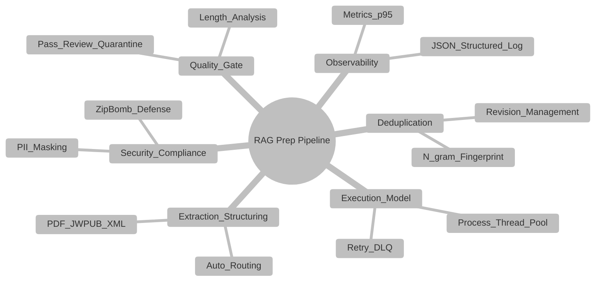
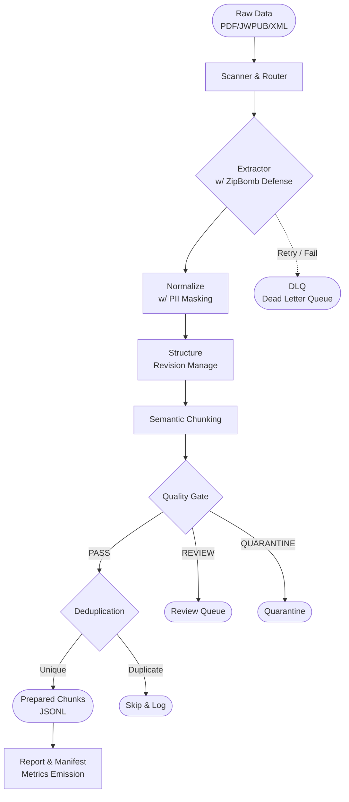

<h1 align="center">RAG Data Preparation Pipeline</h1>
<p align="center">
  <em>Enterprise-Grade On-Premises Batch Data Processing for RAG Systems</em>
</p>

## 📌 1. 프로젝트 정체성 (Project Identity)

**"왜 이 프로젝트가 존재하는가?"**
대규모 생성형 AI(GenAI) 및 검색 증강 생성(RAG) 시스템의 성능은 전적으로 '데이터의 품질'에 달려 있습니다. 하지만 기존의 단순한 파싱 스크립트들은 수십만 건의 대규모 엔터프라이즈 환경에서 데이터 유실, 중복 인덱싱, 개인정보 유출, 파이프라인 중단 등의 치명적인 문제를 야기합니다. 

이 파이프라인은 단순한 데이터 추출을 넘어, **데이터의 품질(Quality), 보안(Security), 추적성(Lineage), 그리고 내결함성(Fault-tolerance)** 을 보장하기 위해 설계된 **엔터프라이즈급 온프레미스 배치 시스템**입니다. 일반적인 파이프라인과 달리 오류가 발생해도 시스템이 멈추지 않고(DLQ 라우팅), 동일한 작업을 다시 수행해도 결과가 동일하며(멱등성), 생성된 모든 청크의 버전과 출처가 기록됩니다.

---

## 🏗 2. 시스템 개요 (System Overview)

본 시스템은 상호 보완적인 6개의 핵심 엔터프라이즈 모듈로 결합되어 있습니다.



위 영역들은 상호작용하여 결함 없는 RAG 텍스트를 산출합니다. (예: `Extraction` 중 `Security`가 Zip Bomb을 방어하고, 추출된 텍스트는 `Quality Gate`를 거치며, 중복은 `Deduplication`이 제거한 뒤 최종적으로 `Observability`에 통계로 기록됩니다.)

---

## 🔄 3. 파이프라인 전체 흐름 (Pipeline Flow)



---

## 💎 4. 엔터프라이즈 특성 (Enterprise Characteristics)

1. **멱등성 (Idempotency)**: 파이프라인을 여러 번 재실행해도 기존 성공 마커(`#success.json`)를 판별하여 스킵하므로 시스템 상태의 일관성을 100% 보장합니다.
2. **재현성 (Reproducibility)**: 실행할 때마다 `manifest.json`이 생성되어 당시의 Git Commit, 파라미터(Config), OS 환경 등 실행 콘텍스트가 박제됩니다.
3. **확장성 (Scalability)**: 병렬 처리 전략인 `Executor` 추상화를 통해 I/O 바운드 작업은 ThreadPool로, CPU 바운드 작업은 ProcessPool로 즉시 전환 및 확장이 가능합니다.
4. **보안 (Security)**: `Regex` 기반 PII(개인정보) 마스킹 기능과 악의적 압축 해제 공격(Zip Bomb)을 원천 차단하는 가드가 포함되어 있습니다.
5. **감사 지원 및 데이터 계보 (Audit & Lineage)**: 산출된 모든 청크(`.jsonl`) 안에는 해당 문단이 어떤 원본 파일, 어떤 파이프라인 버전을 거쳤는지 증명하는 `lineage` 객체가 포함됩니다.

---

## 🚀 5. 설치 가이드 (Quick Start)

### Requirements
- OS: MAC / Linux (온프레미스 권장)
- Python 3.10+

### 가상환경 설정 및 설치
```bash
# 가상환경 생성 및 진입
python -m venv venv
source venv/bin/activate

# 의존성 패키지 설치
pip install -r requirements.txt
```

### 실행 예제 (CLI Options)
가장 보편적인 엔터프라이즈 배치 실행 스크립트입니다.
```bash
python -m ragprep.prepare \
  --input-dir data/raw \
  --output-dir data/prepared \
  --merge-group true \
  --quality-gate true \
  --dedupe true \
  --pii-mask \
  --executor process \
  --max-retries 2 \
  --force
```

---

## 🛠 6. 운영 시나리오 예시

- **대규모 문서 일괄 처리 (`--merge-group`)**: 수만 개의 분산된 `.xml`, `.pdf` 파일이 동일한 하위 디렉토리에 속해 있을 경우, 파이프라인은 이들을 단일 문서의 컬렉션으로 논리적 병합하여 컨텍스트 단절 없이 청킹합니다.
- **문서 개정 (Revision) 발생 시**: 수정된 문서가 재인입되면 `structure.py`에서 기존 SHA256 해시와 비교 후, 내용이 변경되었을 때만 `revision`을 +1 증가시키고 기존 문서는 `revisions/` 폴더로 백업합니다.
- **장애 및 예외 대응 (DLQ & Quarantine)**: 파이프라인 도중 파싱 에러가 발생하더라도 멈추지 않습니다. 최대 2회 지수 백오프(Exponential Backoff) 재시도를 거치며, 그래도 실패할 경우 원본을 `data/dlq/` 로 이동시켜 개발자가 후행 조치할 수 있게 합니다.

---

## 📂 7. 산출물 디렉토리 구조 (Directory Output)

파이프라인 실행 후 보장되는 출력 디렉토리 트리는 다음과 같습니다.

```text
data/
├── raw/                  # (Input) 원본 소스
├── extracted/            # (Mid) Extractor 추출물 (JSON)
├── normalized/           # (Mid) PII 마스킹 및 전처리 완료본
├── prepared/
│   ├── documents/        # 구조화 및 Revision이 완료된 본문
│   │   ├── revisions/    # 이전 버전 스냅샷 백업
│   │   └── {doc_id}.document.json
│   ├── chunks/           # RAG 데이터베이스 인입 대기열
│   │   └── {group_id}/
│   │       └── {doc_id}.chunks.jsonl
│   └── reports/          # 실행 Summary 로그
├── runs/
│   └── {run_id}/
│       ├── manifest.json # 빌드/환경 추적 매니페스트
│       └── metrics.json  # P95 소요시간 등 관측 지표
├── dlq/                  # Retry 이후 최종 실패 문서 버퍼
├── quarantine/           # Quality Gate 미달/치명적 포맷 오류 
└── review/               # 인간 검수(Human-in-the-loop) 필요 문서
```

---

## 🛡 8. 배포 및 호환성 (Compatibility & Stability)

이 파이프라인 코드는 완전한 **Zero-external-dependency (외부 DB/큐 인프라 미사용)** 배치가 가능하도록 순수 폴더 구조와 파이썬 언어로 아키텍처링 되었습니다. 
- 본 프로젝트의 `README.md` 및 `docs/` 폴더 내 모든 문서는 GitHub Markdown 규격을 철저히 준수합니다.
- 복잡한 Mermaid 다이어그램 렌더링이 외부 플러그인 없이 네이티브 모드에서 오류 없이 표출되도록 안정성을 각별히 검증했습니다.

> 자세한 모듈별 상세 스펙 및 권한 운영 정책은 [docs/ 폴더를 참조하세요](./docs/ko/architecture.md).
