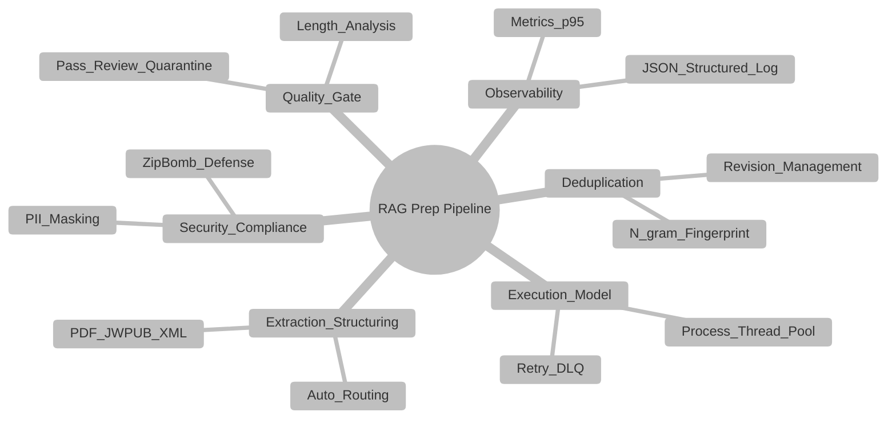
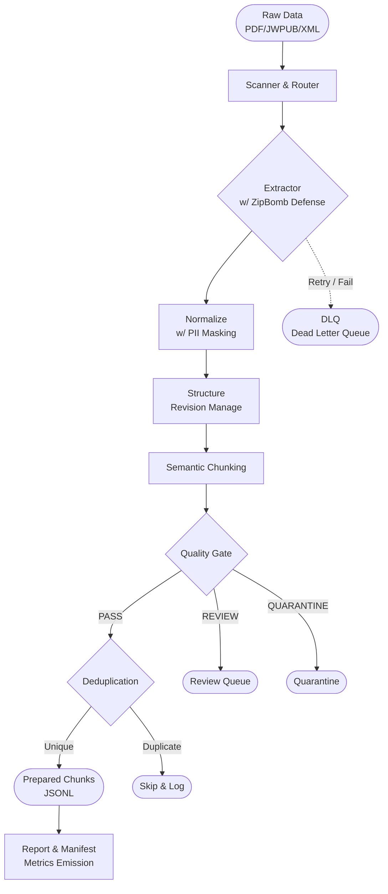

<h1 align="center">RAG Data Preparation Pipeline</h1>
<p align="center">
  <em>Enterprise-Grade On-Premises Batch Data Processing for RAG Systems</em>
</p>

## 📌 1. Project Identity

**"Why does this project exist?"**
The performance of massive Generative AI and Retrieval-Augmented Generation (RAG) systems depends entirely on the 'Quality of Data'. However, simple parsing scripts used traditionally cause fatal issues in enterprise environments with hundreds of thousands of documents, such as data loss, duplicate indexing, PII exposure, and pipeline interruptions.

This pipeline goes far beyond simple data extraction. It is an **Enterprise-Grade On-Premises Batch System** designed strictly to guarantee **Data Quality, Security, Lineage, and Fault-Tolerance**. Unlike generic pipelines, this system never halts upon an error (DLQ routing), produces identical results when run multiple times (Idempotency), and records the exact version and origin of every generated chunk.

---

## 🏗 2. System Overview

The system is tightly coupled with 6 core enterprise modules.



These domains interact symbiotically to produce flawless RAG text. (e.g., During `Extraction`, `Security` defends against Zip Bombs, extracted text passes through the `Quality Gate`, duplicates are removed by `Deduplication`, and the metrics are finally recorded in `Observability`.)

---

## 🔄 3. Pipeline Flow



---

## 💎 4. Enterprise Characteristics

1. **Idempotency**: Rerunning the pipeline will reliably skip existing verified successful outputs (`#success.json`), strictly guaranteeing 100% state consistency.
2. **Reproducibility**: A `manifest.json` is generated for every run, permanently recording the execution context such as the Git Commit, config parameters, and OS environment.
3. **Scalability**: The `Executor` abstraction allows immediate switching and scaling between ThreadPool (for I/O-bound tasks) and ProcessPool (for CPU-bound tasks).
4. **Security**: Regex-based PII masking and guards against malicious archive extractions (Zip Bombs) are natively implemented.
5. **Audit & Lineage**: Every emitted chunk `.jsonl` embeds a `lineage` object proving exactly which source file and pipeline version it originated from.

---

## 🚀 5. Quick Start

### Requirements
- OS: MAC / Linux (On-Premises Recommended)
- Python 3.10+

### Virtual Environment Setup
```bash
# Create and enter virtual environment
python -m venv venv
source venv/bin/activate

# Install dependencies
pip install -r requirements.txt
```

### Execution Example (CLI Options)
The most common enterprise batch execution script:
```bash
python -m ragprep.prepare \
  --input-dir data/raw \
  --output-dir data/prepared \
  --merge-group true \
  --quality-gate true \
  --dedupe true \
  --pii-mask \
  --executor process \
  --max-retries 2 \
  --force
```

---

## 🛠 6. Operating Scenarios

- **Massive Document Grouping (`--merge-group`)**: When tens of thousands of fragmented `.xml` or `.pdf` files belong to the same subdirectory, the pipeline logically merges them into a single coherent document collection, retaining context during chunking.
- **Handling Revisions**: When a modified document is reinserted, `structure.py` compares the SHA256 hash. If changed, the `revision` increments by +1, and the previous version is backed up into the `revisions/` archive.
- **Fault Tolerance (DLQ & Quarantine)**: Parsing errors do not stop the pipeline. A document undergoes max 2 exponential backoff retries. If it ultimately fails, the original is moved to `data/dlq/` for developer intervention.

---

## 📂 7. Directory Output Structure

The guaranteed output directory tree after processing:

```text
data/
├── raw/                  # (Input) Original Source
├── extracted/            # (Mid) Extractor JSON output
├── normalized/           # (Mid) PII Masking / Sanitized output
├── prepared/
│   ├── documents/        # Structured & Revision-managed text
│   │   ├── revisions/    # Snapshots of previous versions
│   │   └── {doc_id}.document.json
│   ├── chunks/           # RAG Database Queue
│   │   └── {group_id}/
│   │       └── {doc_id}.chunks.jsonl
│   └── reports/          # Execution Summary Logs
├── runs/
│   └── {run_id}/
│       ├── manifest.json # Build/Env Tracking Manifest
│       └── metrics.json  # P95 Time Metrics
├── dlq/                  # Final failed documents after retries
├── quarantine/           # Quality Gate failures / Formatting errors
└── review/               # Documents requiring Human-in-the-loop review
```

---

## 🛡 8. Deployment and Compatibility

This pipeline is architected purely in Python and file structures, enabling completely **Zero-external-dependency (No separate external DB/Queue infrastructure required)** batch deployments.
- All documents in the `README.md` and `docs/` folder strictly adhere to GitHub Markdown specifications.
- Complex Mermaid diagrams have been carefully validated to render flawlessly in native Markdown without external plugins.

> For detailed module specifications and permission policies, please refer to the [docs/ folder](./docs/en/architecture.md).
