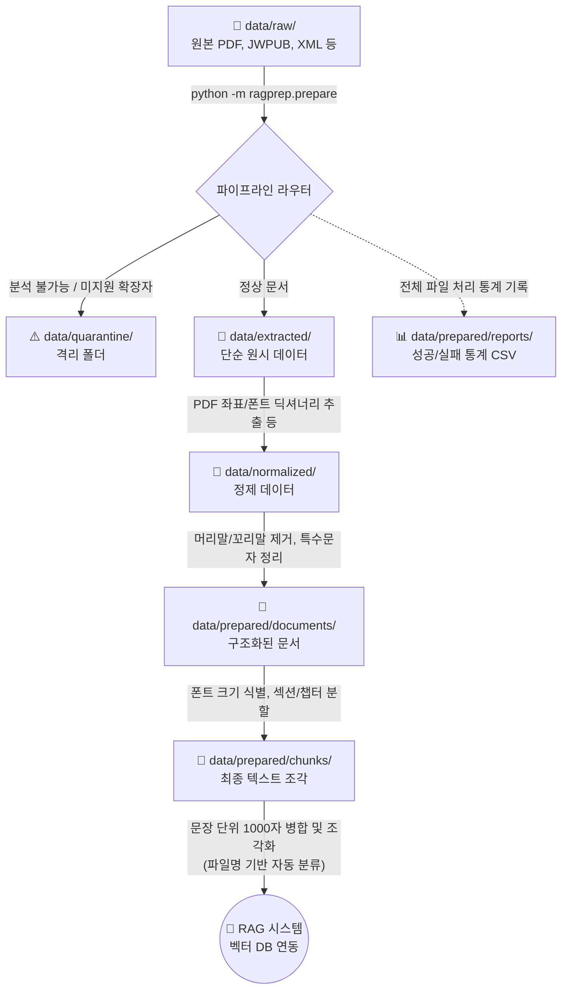

# RAG Data Pipeline 사용 설명서 (User Manual)

본 문서는 RAG(Retrieval-Augmented Generation) 시스템 구축을 위해 원본 문서를 가공하는 파이프라인의 실행 방법과 처리 흐름, 그리고 최종 산출물의 활용 방법을 안내합니다.

## 🚀 파이프라인 실행 방법

터미널에서 프로젝트 최상위 경로에 위치한 상태로 아래의 명령어를 실행합니다.

```bash
python -m ragprep.prepare --input data/raw --out data --concurrency 4
```

### CLI 주요 옵션

* `--input`: 가공할 원본 파일들(`*.pdf`, `*.jwpub`, `*.xml`)이 모여 있는 폴더를 지정합니다. (기본값: `data/raw`)
* `--out`: 결과물들이 생성될 최상위 폴더를 지정합니다. (기본값: `data`)
* `--concurrency`: 동시에 처리할 파일의 개수를 지정합니다. (기본값: 2) 멀티프로세싱(ProcessPoolExecutor)을 사용하여 CPU 코어 수에 비례한 속도 향상을 보여줍니다. Mac의 경우 최대 8정도를 권장합니다.
* `--force`: (선택) 이미 처리가 완료되어 마커(`*.success.json`)가 존재하는 파일도 무시하고 강제로 다시 처리합니다.

---

## 📊 파이프라인 처리 흐름도 (Data Flow)

파이프라인이 실행되면 입력된 데이터는 다음과 같이 변환되며 각 폴더로 흘러갑니다.



---

## 📂 출력 폴더 상세 안내 (어떤 데이터가 어떻게 나오는가?)

명령어가 성공적으로 실행되면 `--out` 으로 지정한 폴더 내부에 다음과 같은 디렉토리 구조가 생성됩니다.

### 1. `data/quarantine/` (격리소)

* **내용**: 파이프라인이 처리하다가 **에러**가 났거나(예: 텍스트가 추출되지 않는 이미지 스캔 PDF, 손상된 압축 파일), 지원하지 않는 확장자(`txt`, `doc` 등)인 원본 파일이 통째로 이사옵니다.
* **디버깅**: 각 파일이 격리된 폴더 안에는 왜 실패했는지를 알려주는 `fail.json` 파일이 함께 생성됩니다.

### 2. `data/extracted/` (원시 추출 데이터)

* **내용**: 가공 전 단계의 원시 데이터입니다. PDF의 경우 읽어들인 문자의 좌표(`bbox`(좌/우/상/하))와 폰트 크기, 스타일 정보가 모두 노출된 형태의 구조 (`*.pages.json`)가 저장됩니다.

### 3. `data/normalized/` (정제 데이터)

* **내용**: 원시 데이터에서 불순물을 걸러낸 상태입니다. 눈에 보이지 않는 특수 문자(제어 코드)가 날아가고, 문서 상/하단을 반복적으로 차지하는 **머리말/꼬리말의 반복 좌표 영역이 완전히 삭제된** 텍스트 블록 정보(`*.normalized.json`)입니다.

### 4. `data/prepared/documents/` (구조화 문서)

* **내용**: 단순히 텍스트만 이어 붙인 것이 아니라, 폰트가 유독 큰 글씨를 '장/절' 제목(Heading)으로 인식하거나 (PDF), `<label>` 구조를 파악하여 (JWPUB/XML) **하나의 파일 내에서 논리적인 챕터 계층 구조로 쪼개놓은** 정보(`*.document.json`)입니다. 이 정보를 바탕으로 RAG 검색 시 "이 내용은 OOO 챕터에 나옵니다"와 같은 출처 표기가 가능해집니다.

### 5. `data/prepared/reports/` (실행 리포트)

* **내용**: 파이프라인 배치 작업을 1회 구동할 때마다 1세트(CSV 1개, JSON 1개)의 리포트 파일(`run-summary-*.csv` 등)이 떨어집니다.
* **용도**: 총 몇 개의 파일을 처리했고, 몇 개가 성공/실패했는지, 실패했다면 사유가 무엇인지(예: `UNSUPPORTED_TYPE`, `EXTRACT_FAIL`)를 한눈에 확인할 수 있는 통계 요약본입니다. 명령 실행 후 터미널 창(CLI) 맨 마지막에도 빨간색 경고 문구로 에러 요약이 시인성 좋게 출력됩니다.

---

## 🎯 활용 안내: RAG 시스템 (Vector DB) 구축 시 사용할 파일

가장 핵심이 되는 최종 산출물은 **딱 한 폴더**에 모입니다.

👉 사용해야 할 최종 폴더: **`data/prepared/chunks/`**  
👉 사용해야 할 파일 형식: **`*.chunks.jsonl`**

### 자동 폴더 분류 (Hierarchical Routing)

파이프라인은 원본 파일의 이름을 분석하여 `data/prepared/chunks/` 내부에 자동으로 **계층형 서브 폴더**를 만들어 결과물을 깨끗하게 정리합니다:

* **연월 시리즈 (예: `g_KO_202511_02.pdf`)**: `G_KO/g_KO_202511/` 폴더 산하로 자동 분류
* **일반 넘버링 시리즈 (예: `genesis1.xml`)**: `genesis/` 폴더 산하로 자동 분류
* **단일 파일 (예: `nwt_KO.pdf`)**: `etc/` 폴더 산하로 분류

### 왜 `chunks.jsonl` 을 사용해야 하나요?

해당 파일은 앞선 모든 과정(좌표 추출, 머리말 제거, 논리적 제목 구조화)을 거친 뒤, LLM이 문서를 가장 흡수하기 좋은 이상적인 크기(1,000자 내외)로 가공된 최종본입니다.
특히 중간에 단어가 잘리지 않도록 **마침표 기준 문장 단위로 앞뒤 문맥(Overlap)을 보존**하며 조각(Chunk)을 냈기 때문에 임베딩(Embedding) 품질이 훌륭하게 유지됩니다. 또한 특수한 XML(예: 성경 dtbook 포맷)의 경우, 길이 제한을 무시하고 **정확히 "1절 = 1청크" 단위로 논리적 분할**이 진행됩니다.

* **포맷 특징**: `.jsonl` 포맷은 파일 한 줄(Line)이 완벽한 1개의 JSON 객체(Chunk 조각)를 이룹니다.
* **적용 방법**: 파이썬 코드 등으로 파일 내용을 한 줄씩 읽어 딕셔너리로 파싱하면, 내부에 원본 파일의 해시, 소속 챕터 이름, 핵심 텍스트가 모두 쪼개져 담겨 있습니다. 이 객체를 그대로 Vector DB나 LangChain / LlamaIndex 등 임베딩 생성 모델의 Payload 로 던져주기만 하면 효율적인 RAG 데이터 구축이 완료됩니다.
