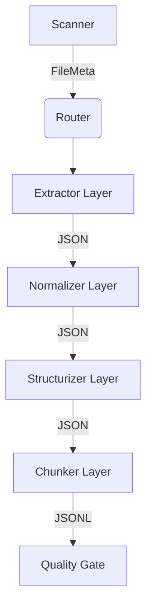

# Architecture

**Target Audience**: System Architects, Pipeline Developers
**Objective**: Guide to understanding the core layered architecture and module dependencies of the RAG data pipeline.
**Scope**: Responsibility and data flow of modules under `ragprep/core/`.

---

## 1. Layered Architecture

The pipeline strictly follows Unidirectional Data Flow and minimizes dependencies. Each stage only passes its output to the adjacent next stage.

## 2. Module Dependencies

The core principle here is **Separation of Concerns**. 
No module manages the business logic of another. Information exchange is conducted purely through the shared `models.py` (Pydantic Schema) contract.

- `models.py`: Pydantic DTO shared across all modules.
- `io.py`: Dedicated to initializing directory paths for data persistence.
- `executor.py`: Governs multi-processing and execution retries.

## 3. Data Flow Lifecycle

1. **Scanner (`scanner.py`)**: Recursively scans `data/raw/` to instantiate `FileMeta` models.
2. **Router (`router.py`)**: Routes to appropriate extractors based on the `merge-group` mode and specific extension (`.pdf`, `.jwpub`, `.xml`).
3. **Extractor (`extract_*.py`)**: Parses raw text from PDF blocks, XMLs, and JWPUB SQLite, saving to `extracted/`.
4. **Normalizer (`normalize.py`)**: Removes invisible characters, compresses whitespace, masks `PII`, and produces JSON to `normalized/`.
5. **Structurizer (`structure.py`)**: Splits documents into logical sections via font-size heuristics, performing hash diffing for revisions (`prepared/documents/`).
6. **Chunker (`chunk.py`)**: Slices text into semantic 1000-character boundaries post Dedupe, finalizing indexing payloads (`prepared/chunks/`).
7. **Quality Gate (`quality.py`)**: Evaluates the chunks for length and structural health, assigning `PASS`/`REVIEW`/`QUARANTINE`.
