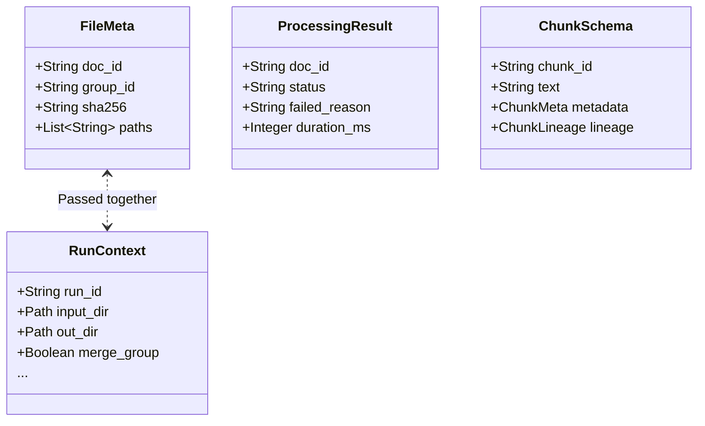

# Data Models

**Target Audience**: Application Developers, Extender Engineers
**Objective**: Understand the rigid structural agreements (Schemas) bounding the modular architecture array.
**Scope**: All encapsulated properties resident inside `ragprep/core/models.py`.

---

## 1. Architectural Overview

At no juncture do independent stages communicate through simplistic types like `Dict` or nested `Tuple`. Inputs/Outputs across pipeline layers aggressively cast data into rigorously verified structures inheriting `pydantic.BaseModel`. Type hinting enforces immutability and absolute predictable payloads.

## 2. Critical Protocol Dissections

### `RunContext` & `RunConfig`
- Command-central lifecycle supervisors.
- Initializing CLI arguments directly funnel into this paradigm, ensuring downstream operators interact synchronously with user demands (`pii_mask`, `executor_type`, runtime directory constants).

### `FileMeta`
- Describes static scanner findings representing literal physical data sources.
- When executing the `--merge-group` dynamic, an array of recursive children paths populate into the collective `FileMeta.paths` array.

### `DocumentSchema` & `ChunkSchema`
- **DocumentSchema**: Derived from Structurizers; houses text components alongside sequential identifiers tracing historical revisions (`normalized_sha256`, `revision`).
- **ChunkSchema**: Final JSONL format ingested by external Document Retrievers (Elasticsearch/Weaviate). Synthesizes isolated Text segments along with absolute `lineage` proofs.

### `ProcessingResult`
- Centralized Status Event dispatcher documenting holistic traversal attempts per file or grouping array.
- Carries routing instructions cascading into Quality Gate responses (`PASS`, `REVIEW`, `QUARANTINE`) determining if directories push into production output, DLQ repositories, or review tiers.
