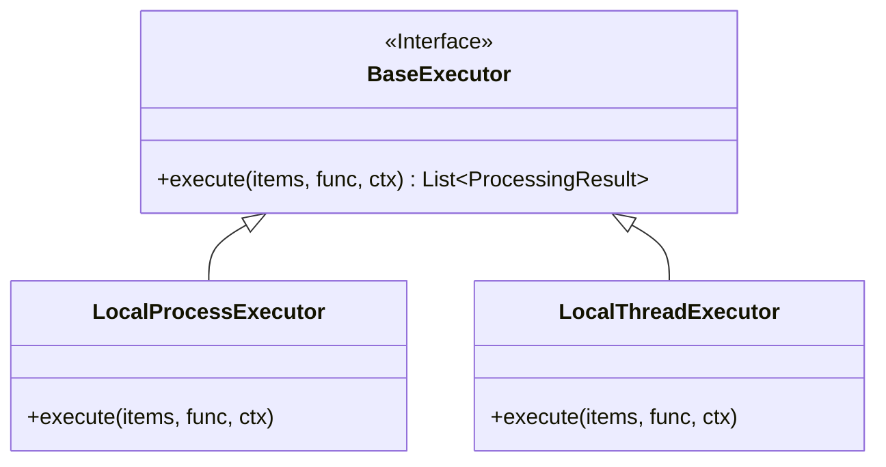

# Execution Model

**Target Audience**: Backend Scalability Optimizers
**Objective**: Understand the asynchronous dispatch interfaces and fault-tolerant retry wrappers propelling gigabyte-scale document workflows.
**Scope**: Sub-routines governing `ragprep/core/executor.py`.

---

## 1. The Executor Abstraction

Python natively grapples with the global interpreter lock (GIL). Concurrent thread utilization excels at I/O waiting but catastrophically bottleneck CPU-intensive operations such as Regex text parsing or Jaccard mathematics.

We institute the uniform `BaseExecutor` abstract class, which dynamically instantiates worker environments conforming to terminal prerequisites.

## 2. ProcessPool vs. ThreadPool Directives

| CLI Argument | Mechanistic Principle | Recommended Usecases |
| :--- | :--- | :--- |
| `--executor process` | **Multi-Core Saturation**: Forks separate Python daemons independent of GIL interference. Physical cores operate at 100% capacity providing extreme data-crunching velocities but suffer heavy memory inter-process serialization. | JWPUB Extractions, Massive PDF string replacements, Grand-scale Dedupe Jaccard evaluations. |
| `--executor thread` | **Lightweight Context-Switches**: Maneuvers tasks inside the GIL perimeter. Memory footprint is marginal, making it exceptionally fast when handling thousands of blocking file-read operations. | OS I/O operations, Local file copying, Thousands of micro-XML sweeps. |

## 3. Resiliency, Scalability & Retry Wrappers

An enterprise batch system should never collapse its multi-thread domain simply because a single malformed file triggers an unexpected `Exception`. Thus, all parallel executions route through the `RetryWrapper` decorator.

- **Exponential Back-off Mechanism**: Configured via `max_retries`. If execution fails locally, the worker halts for `retry_backoff_ms`. This pause cascades exponentially at a 2x rate during continuous failures to prevent database throttling. (e.g., 2s -> 4s -> 8s)
- Exhausted retries do not halt neighboring files. The thread finalizes, logs the failure signature to `result.status`, and safely completes the execution phase, yielding a zero-side-effect error isolation.
