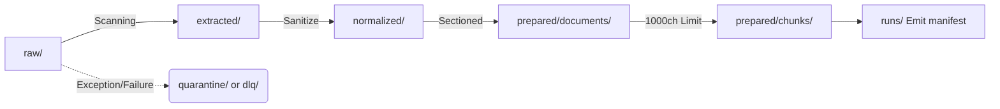

# Folder Structure

**Target Audience**: Entire Collaboration Teams
**Objective**: Ascertain the contextual flow mapping digital assets across logical staging environments mapping.
**Scope**: In/Out tree logic traversing the `data/` volume matrix.

---

## 1. Staging Lifecycles

Directories transcend basic storage functions; they materialize explicit State Machines declaring an asset's phase across processing milestones. 

## 2. Directory Layout Architecture

Artifact lifespans delineate temporary logic vectors (`extracted`, `normalized`) distinct from immutable deployment clusters needing systematic version snapshots (`prepared/`).

### 🗃 `data/raw/` (Read Only Immutable)
- Ingress terminal. Original `.pdf`, `.xml`, `.jwpub` assets drop here and are NEVER mutated or damaged by pipeline iterations.
- If nested structures exist `/data/raw/genesis/01.xml`, the CLI flag `--merge-group` leverages `genesis` as an indexing logical identifier.

### 🗑 `data/extracted/` & `data/normalized/` (Evaporating Cache)
- Captures intermediate pipeline outputs post noise-cancellation matrices or PII filtering payloads before structuring occurs.
- Filename format: `{doc_id}.jwpub.json` / `{doc_id}.normalized.json`

### 📚 `data/prepared/documents/`
- Full-length, historically revision-tracked master documents ready for database integration. Upgraded versions (recognized via Hash alterations over `normalized_sha256`) trigger legacy fallback archiving nested into `revisions/`.

### 🧩 `data/prepared/chunks/`
- Semantic payloads truncated for optimal ingestion. Formatted as `JSONL` arrays isolating Memory restrictions during OpenSearch Bulk-Inserts: `{group_id}/{doc_id}.chunks.jsonl`.

### 🛑 Isolation Safetynets (Escalation Matrices)
- **`data/review/`**: Human-In-The-Loop escalation bin accumulating outputs that failed structural integrity AI thresholds.
- **`data/quarantine/`**: Highly malicious or permanently corrupted files forcibly discarded from processing channels.
- **`data/dlq/`**: The Dead Letter Queue terminal containing untouched `raw` source backups post `RetryWrapper` collapse for engineering debugging.
