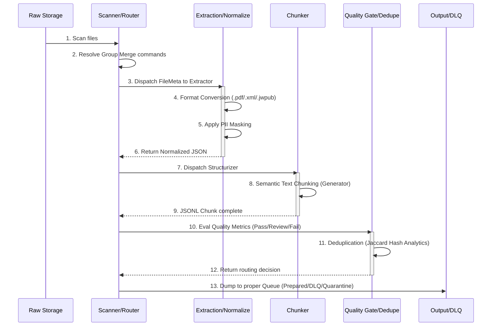

# Pipeline Flow

**Target Audience**: Pipeline Operators, Batch Managers
**Objective**: Visualize the physical and logical path of data from its origin to the RAG DB entry queue.
**Scope**: End-to-end processing from Raw data ingestion to Quality Gate and Dedupe.

---

## Pipeline Lifecycle Diagram

As the pipeline is idempotent, it features 5 persistent checkpoint step-boxes, enabling safe resumption upon unexpected hardware failures.

### Lifecycle Characteristics
- **Step 1~3**: Dispatch FileMeta streams into Thread/Process Pools via the `Executor` to eliminate CPU idle time.
- **Step 4~6**: On-premises disk I/O flushes prevent Out-Of-Memory (OOM) exceptions.
- **Step 7~9**: Utilizes Python Generators (`yield`) during chunking to write to physical drives continuously.
- **Step 10~13**: Prompt folder routing judgments (`mv`/`cp`) are governed by length heuristics and N-gram fingerprints.
