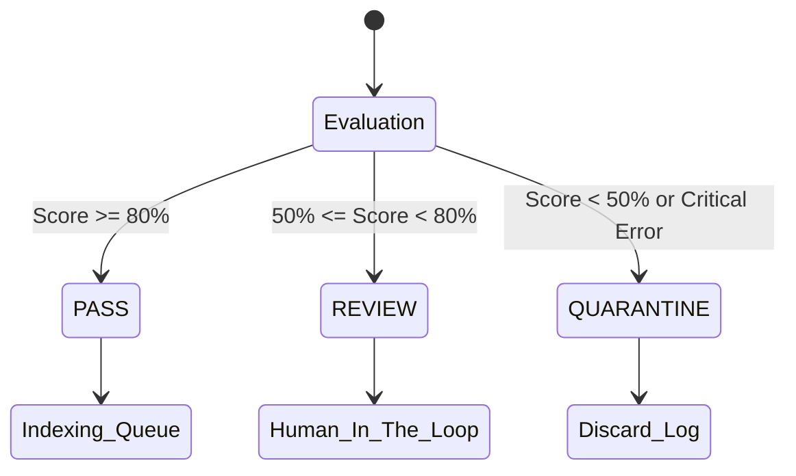

# Quality Gate

**Target Audience**: Pipeline Operators, Data Engineers
**Objective**: Learn the standards and threshold tuning strategies used to autonomously judge whether text chunks are healthy for the RAG database integration.
**Scope**: Scoring logic and routing policy (`Pass`/`Review`/`Quarantine`) in `ragprep/core/quality.py`.

---

## 1. Quality Scoring

The Quality Gate comprehensively reviews the output list in `chunks.jsonl` to measure the document's **Healthy Score**.

- **Evaluation Metrics**:
  1. The ratio of chunks that are exceedingly short (e.g., under 50 chars) compared to the total extracted characters.
  2. The concentration of overly massive blocks or meaningless HTML tag remnants (`<`, `>`, etc.).
  

## 2. Quality Statuses

1. **PASS**
   - **Criteria**: All chunks fall into accepted length tolerances and maintain structural RAG appropriateness.
   - **Action**: Outputs a `#success.json` identifier in `prepared/documents/`. Chunks proceed to the indexer safely.

2. **REVIEW (Human in the loop)**
   - **Criteria**: Widespread short chunks were detected, but not completely invalid (e.g., Short Bible verses, tables).
   - **Action**: Bypasses the `#success.json` seal and migrates the source and `quality.json` to the `data/review/` tier. Operators inspect `reasons` and manually greenlight indexing.

3. **QUARANTINE (Isolation/Discard)**
   - **Criteria**: Zero-byte content in parsed sections, unparsed raw formats, or fatal layout deterioration.
   - **Action**: Emits `[QUARANTINE] doc_id` to standard logs. Content shifts to `data/quarantine/` and is discarded from integration.
