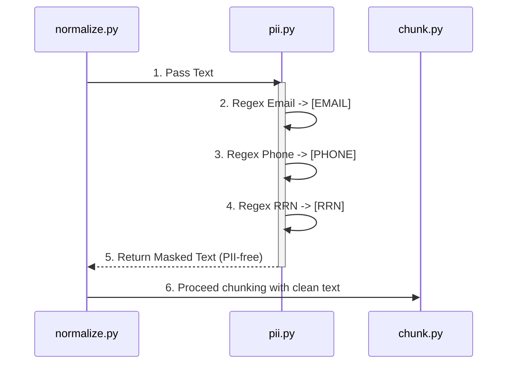

# Security & Compliance

**Target Audience**: Security Officers, System Admins
**Objective**: Ensure safe mitigation of Personally Identifiable Information (PII) exposure inside chunks and defend the environment against malicious Zip Archive exploits.
**Scope**: PII Masking Regex in `ragprep/core/pii.py` and Zip Bomb safeguards in `extract_jwpub.py`.

---

## 1. PII Masking Control

It is a critical vulnerability if plaintext emails, phone numbers, or resident registration numbers inhabit the RAG Database. The pipeline accommodates native Regex-based substitutions (`--pii-mask` flag).

### PII Regex Patterns
- **Email**: `[A-Za-z0-9._%+-]+@[A-Za-z0-9.-]+\.[A-Z|a-z]{2,}`
- **Phone Number**: `010-\d{3,4}-\d{4}`
- **Registration Number (KOR)**: `\d{6}-[1-4]\d{6}`

These patterns are transformed into `[EMAIL]`, `[PHONE]`, and `[RRN]` identifiers to sanitize the text uniformly without destroying sentence structures.

## 2. Format Security: Zip Bomb Protections

JWPUB data is enclosed in ZIP archives. Thus, they represent a vector for **Zip Bomb** attacks (files inflating into Terabytes upon extraction).

The pipeline scans the internal directory tree of the zip directly in memory BEFORE executing `extractall()`.

- **Guard Thresholds**:
  - **MAX_FILES**: Maximum embedded objects (Deny if > 5,000 files).
  - **MAX_TOTAL_SIZE**: Maximum uncompressed target volume (Deny if > 500MB).
  - **MAX_FILE_SIZE**: Threshold for any single internal payload (Cutoff at 100MB).

Violations trigger immediate exceptions `ValueError(Zip Bomb detected)`, instantly auto-routing the source archive to the `QUARANTINE` storage tier.
