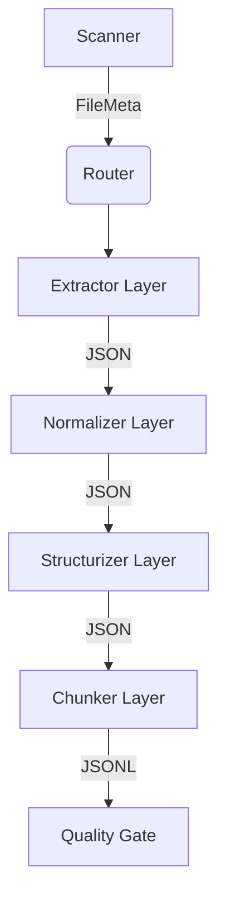

# Architecture (아키텍처)

**대상 독자**: 시스템 설계자, 파이프라인 개발자
**목적**: RAG 데이터 파이프라인의 핵심 계층 구조 및 모듈 간 의존성을 이해하기 위한 가이드입니다.
**범위**: `ragprep/core/` 하위 모듈들의 책임 및 파이프라인 데이터 흐름.

---

## 1. 계층 구조 설명 (Layered Architecture)

파이프라인은 단방향 데이터 흐름(Unidirectional Data Flow)을 따르며 의존성을 최소화하는 방향으로 설계되었습니다. 각 단계(Stage)는 오직 인접한 자신의 결과물만 다음 단계로 넘깁니다.

## 2. 모듈 의존 관계 (Module Dependencies)

이 파이프라인의 핵심 원칙은 **책임 분리(Separation of Concerns)** 입니다.
어느 한 모듈이 다른 모듈의 비즈니스 로직을 전혀 알지 못합니다. 정보의 교환은 공용 `models.py` (Pydantic Schema) 계약을 통해서만 이루어집니다.

- `models.py`: 모든 모듈이 공유하는 Pydantic DTO (Data Transfer Object).
- `io.py`: 데이터 저장을 위한 디렉터리 경로 초기화 전담.
- `executor.py`: 스레드 멀티프로세싱 및 재시도(Retry) 관장.

## 3. 데이터 흐름 (Data Flow Lifecycle)

1. **Scanner (`scanner.py`)**: `data/raw/`를 재귀 탐색하여 `FileMeta` 모델을 생성합니다.
2. **Router (`router.py`)**: `merge-group` 모드와 파일 확장자(`.pdf`, `.jwpub`, `.xml`)에 기반해 적절한 모듈로 라우팅합니다.
3. **Extractor (`extract_*.py`)**: PDF 블록, XML, JWPUB SQLite에서 원시 텍스트를 파싱하여 `extracted/`에 저장합니다.
4. **Normalizer (`normalize.py`)**: 비가시 특수문자 제거, 연속 줄바꿈 방지, 및 `PII`가 마스킹된 `normalized/` JSON을 산출합니다.
5. **Structurizer (`structure.py`)**: 폰트 크기 혹은 태그를 기반으로 문서를 논리적 섹션(Header)으로 분할하며 변경을 감지하여 리비전을 땁니다(`prepared/documents/`).
6. **Chunker (`chunk.py`)**: N-gram Dedupe를 거친 뒤 텍스트를 문장 단위 1000자 내외로 쪼개 인덱싱 가능한 JSONL 포맷(`prepared/chunks/`)으로 종결시킵니다.
7. **Quality Gate (`quality.py`) & Routing**: 완성된 청크의 길이를 평가하여 통과(Pass) 여부를 판가름합니다.
