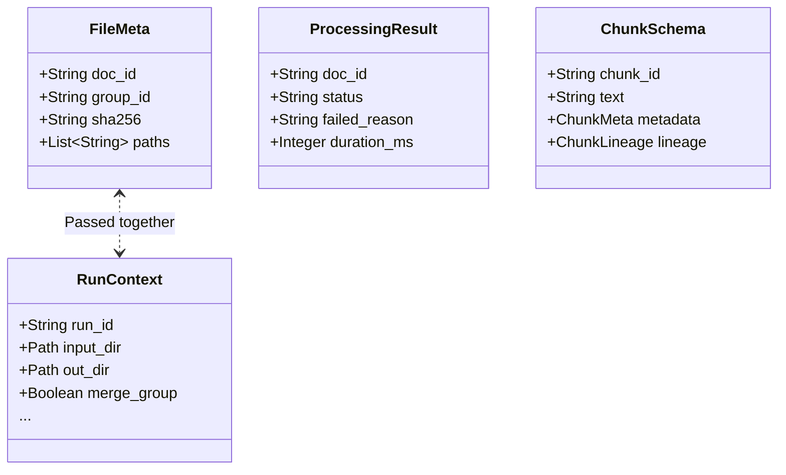

# Data Models (데이터 모델 계약)

**대상 독자**: 파이프라인 확장 개발자
**목적**: 모듈 간 통신에 쓰이는 Pydantic 스키마 구조를 이해합니다.
**범위**: `ragprep/core/models.py`.

---

## 1. 개요 (Overview)

파이프라인의 각 단계는 `Dict`나 `Tuple` 같은 원시 데이터 타입을 주고받지 않습니다. 모든 입력과 출력은 `pydantic.BaseModel`을 상속받은 강력하게 타입 지정된(strongly-typed) 객체로 캐스팅되어 유효성 검사(Validation)를 강제합니다.

## 2. 주요 모델별 상세 (Core Models)

### `RunContext` & `RunConfig`
- 파이프라인 전체의 생명주기를 주관하는 전역 설정 객체.
- 터미널이나 서버에서 전달받은 CLI/환경 변수 옵션들이 이 모델을 거쳐 하위 모듈로 주입됩니다.
- 포함: `pii_mask`, `dedupe_scope`, `executor_type`, 다이내믹 디렉터리 경로.

### `FileMeta`
- 스캐너가 탐지한 개별 파일의 정적 메타데이터.
- `merge-group` 모드로 구동될 때, 동일 디렉토리 경로에 있는 여러 `Path` 집합체는 하나의 `FileMeta.paths` 배열로 병합됩니다.

### `DocumentSchema` & `ChunkSchema`
- **DocumentSchema**: `structure.py`에서 변환한 전체 문서 객체. 문장의 단락들이 `sections` 배열 안에 정리되며, 백업 검증용 `normalized_sha256` 해시와 `revision` 번호를 기록합니다.
- **ChunkSchema**: RAG DB에 최종적으로 Insert(Upsert) 되는 개별 문장 모델입니다. 텍스트 청크 본문(`text`) 조각 외에도 자신이 어디서 파생되었는지를 증명하는 `lineage` 객체를 품습니다.

### `ProcessingResult`
- 각 파일별 / 그룹 문서별 전체 파이프라인 한 사이클이 끝날 때마다 결과(`status`, `failed_reason`, 소요 시간 `duration_ms`)를 취합하여 반환하는 DTO.
- Quality Gate 판정에 따라 `PASS` 또는 `QUARANTINE` 상태를 지니며, `dlq/`로 향할지 `#success.json`을 작성할지를 결정짓는 트리거가 됩니다.
