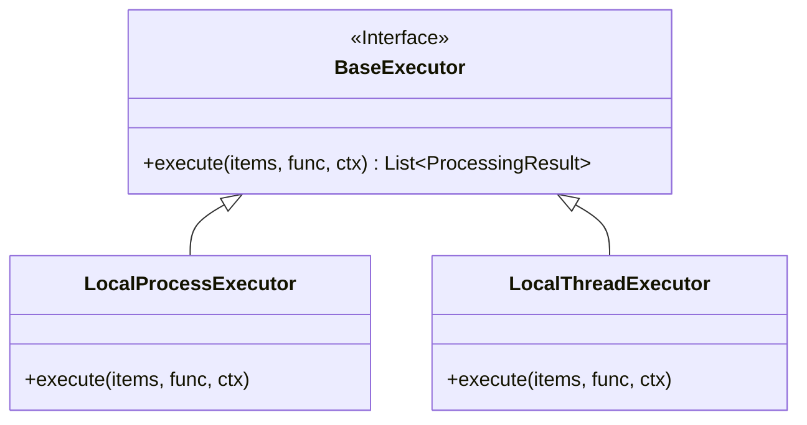

# Execution Model (실행 모델)

**대상 독자**: 백엔드 성능 최적화 담당자, 파이프라인 엔지니어
**목적**: 대용량 IO 문서를 고성능으로 처리하기 위한 비동기 프로세스와 내결함성 재시도 래퍼(Retry Wrapper)의 구조를 이해합니다.
**범위**: `ragprep/core/executor.py`. 

---

## 1. Executor 추상화 패턴

Python의 특성상 멀티스레드 기반 비동기는 I/O 바운드에는 유리하나 GIL(Global Interpreter Lock) 때문에 CPU를 많이 소모하는 파싱과 N-gram 연산에 극심한 지연을 초래합니다.

이를 해결하기 위해 언제든 실행 콘텍스트 환경에 맞춰 엔진을 갈아끼울 수 있도록 표준화된 `BaseExecutor` 인터페이스를 구현하고, 하위에 두 가지 파생 워커 클래스를 제공합니다.

## 2. ProcessPool vs ThreadPool 전략 선택 가이드

| 엔진 (커맨드 인수) | 상세 원리 및 동작 메커니즘 | 최적 사용처 (Recommended Usecase) |
| :--- | :--- | :--- |
| `--executor process` | **다중 코어 점유**: Python 프로세스를 여러 개 포크(Fork)하여 GIL의 간섭을 일절 배제시킵니다. 물리적 코어 숫자만큼 코어가 100% 점유되어 메모리 복사 비용은 높으나 가장 빠른 속도를 자랑합니다. | JWPUB 압축해제, 거대한 PDF 정제, 대규모 Dedupe 해시 비교 |
| `--executor thread` | **가벼운 스코프 점유**: GIL 안에서 Context Switch만 수행합니다. 가벼워 생성에 메모리나 부하가 거의 없으며 네트워크 대기가 잦은 경우 최고의 성능을 뽐냅니다. | 파일 복사, 로컬 디스크의 대규모 자잘한 XML 읽기 쓰기 |

## 3. 확장성 및 내결함성(Fault Tolerance)과 재시도 래퍼

배치 처리 시스템의 덕목은 한 두 개의 파일 찌꺼기 탓에 수천 개의 프로세스가 도미노처럼 붕괴되는 것을 막는 데 있습니다. 파이프라인의 모든 문서 프로세스와 그룹 병합은 이 `RetryWrapper` 데코레이터를 거치게 됩니다.

- **지수 백오프 전략**: `max_retries` 값에 따라 1차 실패 시 지정된 밀리초(`retry_backoff_ms`) 동안 슬립 후 재개합니다. 실패가 반복될 때마다 스로틀링(Throttling)을 방지하기 위해 대기 시간이 **2배(Exponential)** 늘어납니다. (2s -> 4s -> 8s)
- 최종적으로 리미트를 소진한 문서는 에러 원인을 `result.status`에 박제한 채 메인 배치 흐름을 중단하지 않고 빠져나옵니다.
