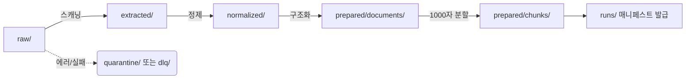

# Folder Structure (폴더 및 산출물 구조)

**대상 독자**: 전체 팀
**목적**: RAG 파이프라인의 물리적 작업 공간의 의미와 상태 전이 방식을 체득합니다.
**범위**: `data/` 내부의 전체 입출력 트리 분석.

---

## 1. 작업 스테이징 플로우 (Staging Flow)

디렉토리는 단순히 파일을 쌓아놓는 공간이 아닌 데이터의 처리 스테이지(Stage)를 의미하며, 디렉토리 구조 자체가 상태 머신(State Machine) 역할을 합니다. 

## 2. 세부 디렉토리 규격 및 파일명 정책

디렉토리 생명 주기 정책상 앞쪽의 중간 객체들(`extracted`, `normalized`)은 임시 파싱물입니다. 영구적으로 이관하고 스냅샷을 백업해야 할 데이터는 `prepared/` 폴더입니다.

### 🗃 `data/raw/` (Read Only)
- 시작점. 사용자가 넣은 원본 PDF, XML, JWPUB가 적재됨. 이 데이터들은 변형되거나 파괴되지 않아야 함.
- 만약 `/data/raw/genesis/01.xml` 처럼 하단에 서브 폴더가 존재하면 `--merge-group`에서 이 폴더 이름(`genesis`)을 추출해 식별자로 삼음.

### 🗑 `data/extracted/` & `data/normalized/` (Temp/Mid Layers)
- Extractor의 노이즈 제거 전 형태, 또는 PII 필터링 후 직렬화된 임시 JSON 파일들.
- 파일 포맷: `{doc_id}.jwpub.json` / `{doc_id}.normalized.json`

### 📚 `data/prepared/documents/`
- 구조가 분류되고, 버저닝이 적용된 RAG 사용 전 원문. 기존 해시(`normalized_sha256`)에 변동이 생기면 예전 파일은 `revisions/` 폴더 내 과거 폴더 번호로 백업됨.

### 🧩 `data/prepared/chunks/`
- 인덱싱 준비가 끝난 청크들. 파일들은 `{group_id}/{doc_id}.chunks.jsonl` 형태로 **JSONL(리스트 스트림)** 저장되어 메모리 제약 없이 Elasticsearch/Opensearch에서 대규모 벌크 인서트를 할 수 있게 최적화됨.

### 🛑 안전 구역 (Safeguard)
- **`data/review/`**: 시스템이 텍스트 품질을 확신하지 못해 인간의 추가 검증이 필요한 경우 문서가 이곳으로 들어감.
- **`data/quarantine/`**: 치명적인 바이너리 손상 또는 빈 문서로 판명된 격리 공간.
- **`data/dlq/`**: `RetryWrapper`에서 부여한 재시도 티켓을 전부 소모하고도 최종 실패한 문서를 분석하기 위한 큐 폴더.
