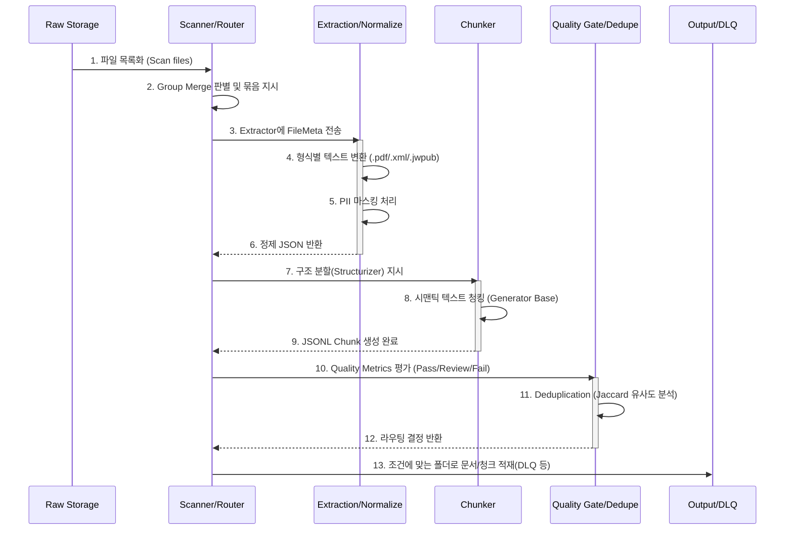

# Pipeline Flow (파이프라인 흐름)

**대상 독자**: 파이프라인 운영자, 배치 관리자
**목적**: 데이터의 시작점부터 RAG DB 진입 대기열까지의 물리적/논리적 경로를 한눈에 파악합니다.
**범위**: Raw 데이터의 인입 ~ Quality Gate 및 Dedupe에 이르는 전 과정.

---

## 파이프라인 생명주기 다이어그램

파이프라인은 멱등성을 지니므로, 도중 프로세스가 고장 나더라도 언제든 재개할 수 있는 5개의 영구적 체크포인트 스텝박스를 지닙니다.

### 각 생명주기별 특징
- **Step 1~3**: CPU 코어를 유휴 상태로 두지 않기 위해 FileMeta를 쪼갠 뒤 `Executor`를 태워 워커 스레드풀로 진입합니다.
- **Step 4~6**: 온프레미스이기 때문에 네트워크 I/O 병목이 존재하지 않습니다. 대부분의 시간은 OOM을 막기 위해 디스크 Flush 하는 시간에 쓰입니다.
- **Step 7~9**: 청크 생성 중 메모리 부족을 방지하기 위해 Python Generator(`yield`) 패턴으로 파일에 직접 스트리밍 방식으로 씁니다.
- **Step 10~13**: 분석된 길이와 N-gram 지문을 바탕으로 즉시 폴더 라우팅(Mv/Copy) 결정을 내립니다.
