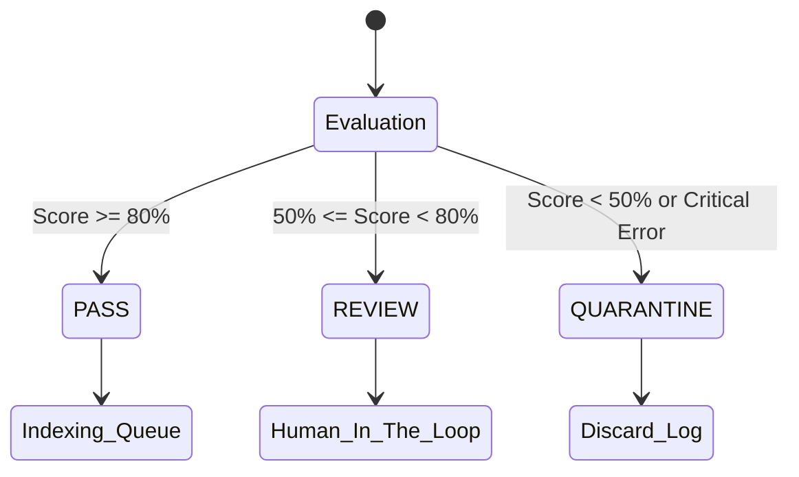

# Quality Gate (품질 게이트 및 리포팅)

**대상 독자**: 파이프라인 운영자, 데이터 엔지니어
**목적**: 생성된 텍스트 청크들이 RAG 데이터베이스로 진입하기에 적합한 품질인지 자동 판별하는 기준과 조정 방법을 학습합니다.
**범위**: `ragprep/core/quality.py` 의 점수 로직과 라우팅 정책 (`Pass`/`Review`/`Quarantine`).

---

## 1. 품질 점수 계산 방식 (Quality Scoring)

Quality Gate는 `chunks.jsonl`에 도출된 전체 청크 리스트를 종합적으로 검토하여 문서의 **Healthy Score**를 평가합니다.

- **평가 항목**:
  1. 전체 추출 문자 수 대비 너무 짧은 청크(예: 50자 이하)의 비율.
  2. 너무 긴 단일 헤더/본문 블록 혹은 의미 없는 특수문자나 찌꺼기(`<` 등)의 비중.
  


## 2. 상태 기준 (Quality Statuses)

1. **PASS (정상 통과)**
   - **기준**: 모든 청크가 정상 범위 내 길이를 가지며, 텍스트의 맥락이 RAG에 적합함.
   - **조치**: `#success.json` 식별자가 `prepared/documents/`에 새겨지며, 청크 파일은 정상적으로 인덱서에 탑재 가능.

2. **REVIEW (인간 검수 대기)**
   - **기준**: 너무 짧은 청크가 많이 발견되었지만, 전체 텍스트 품질이 완전한 불합격 수준은 아님 (예: 성경의 짧은 구절, Q&A 형태의 짤막한 답변 모음 표 등).
   - **조치**: `#success.json` 생성을 보류하고 `data/review/` 디렉터리로 원본과 파생물(`quality.json`)을 통째로 이동(`Mv`)시킵니다. 운영자는 `quality.json`에 기재된 `reasons` 필드를 보고 수동으로 인덱싱할지 백업할지 재량껏 결정합니다.

3. **QUARANTINE (격리조치 / 파기)**
   - **기준**: JWPUB 내 빈 파일, 파싱되지 않고 그대로 노출된 HTML 블록의 다발성 발견, 혹은 의미를 알 수 없는 바이너리 찌꺼기로 인한 치명적 품질 저하.
   - **조치**: 시스템은 `data/quarantine/` 폴더에 `[QUARANTINE] doc_id` 로그를 남기며 해당 청크 데이터는 폐기됩니다.

## 3. 임계치 조정 방법 (Threshold Tuning)

`prepare.py` 실행 시 임계치나 제외 룰에 대한 수치가 필요하다면 소스레벨의 `ragprep/core/quality.py` 내 `evaluate_quality()` 함수의 `min_chars` 비율 제어 변수(휴리스틱 룰)를 튜닝하십시오.

```python
# ragprep/core/quality.py 발췌
def evaluate_quality(meta, ctx, outputs) -> QualityMetrics:
    # 0.9 (90% 이상이 짧을 경우) 혹은 커스텀 비율로 조정
    if short_ratio > 0.9:
        decision = QualityDecision.REVIEW
        reasons.append(f"Too many short chunks: {short_ratio:.2f}")
```
