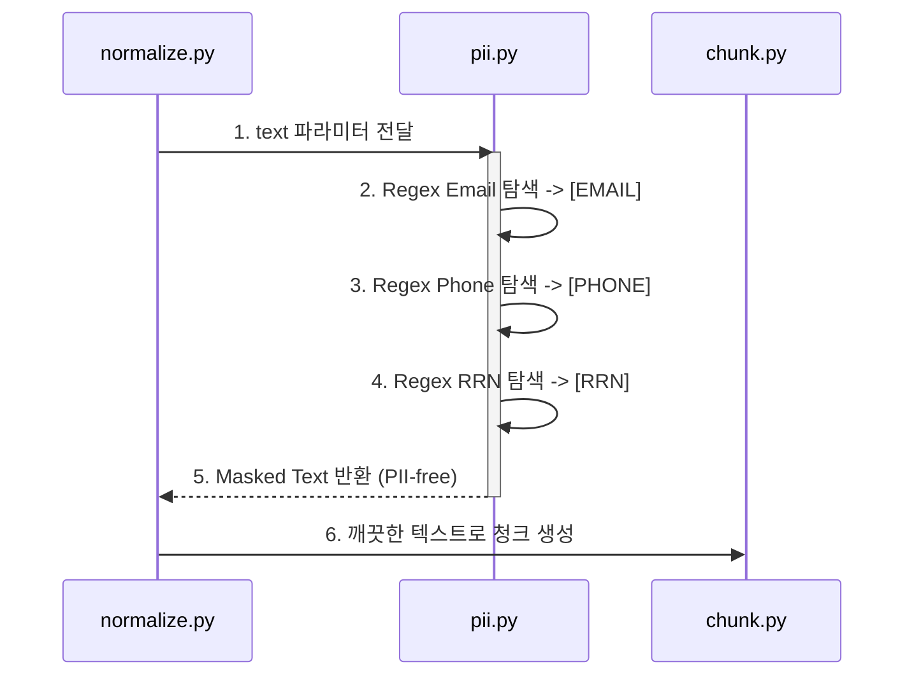

# Security & Compliance (보안 및 컴플라이언스)

**대상 독자**: 보안 담당자, 시스템 관리자
**목적**: 민감 정보(PII)의 안전한 처리 방식과 악의적인 압축 파일 공격에 대한 방어 기제를 보장합니다.
**범위**: `ragprep/core/pii.py`의 마스킹 정책 모델과 `extract_jwpub.py`의 Zip Bomb 차단 로직.

---

## 1. 개인이 식별가능한 정보(PII) 마스킹 제어

RAG 데이터베이스로 인입되는 데이터 내에 이메일, 주민등록번호, 휴대전화번호 등이 평문으로 보관되는 것은 치명적인 보안 위험입니다. 파이프라인은 정규식(Regex) 기반의 텍스트 PII 치환(`Masking`) 옵션을 제공합니다. (`--pii-mask` 플래그)

### PII 정규식 정책 (PII Patterns)
- **이메일**: `[A-Za-z0-9._%+-]+@[A-Za-z0-9.-]+\.[A-Z|a-z]{2,}`
- **휴대전화**: `010-\d{3,4}-\d{4}`
- **주민등록번호(KOR)**: `\d{6}-[1-4]\d{6}`

이 패턴들은 `[EMAIL]`, `[PHONE]`, `[RRN]` 등의 식별자로 대체되어 원본 텍스트의 구조와 길이가 과도하게 훼손되지 않도록 보호합니다.

## 2. 파일 형식 타겟 방어: Zip Bomb 차단 전술

JWPUB 데이터는 복합 압축 아카이브(ZIP)로, 악의적으로 수천만 개의 파일을 내포하거나 풀어냈을 때 테라바이트(TB) 단위로 팽창하는 **Zip Bomb** 공격의 타겟이 될 수 있습니다.

파이프라인의 `extract_jwpub.py` 에서는 압축 풀기(`extractall()`) 메서드를 호출하기 전에 반드시 메모리상에서 트리 스캔을 통한 방어 기제가 선행됩니다.

- **방어 임계치 프로토콜 (Guard Thresholds)**:
  - **MAX_FILES**: 압축 파일 내 최대 객체 개수 (기본 5,000개 초과 시 거부)
  - **MAX_TOTAL_SIZE**: 풀었을 때의 최대 팽창 사이즈 제한 (기본 500MB 통제)
  - **MAX_FILE_SIZE**: 압축 내 존재하는 단일 파일의 상한선 제한 (기본 100MB)

이 제약 조건 중 하나라도 위반하는 데이터가 발견되면 파이프라인은 즉각 `ValueError(Zip Bomb detected)` 예외를 터뜨리고, 파일을 자동 격리 (`QUARANTINE`) 폴더로 전송합니다.

## 3. 로컬 파일 시스템 권한(Permissions) 설계

본 파이프라인은 순수 Python 코드 관점에서 구동되므로, 인프라 내 OS 단의 권한 제어와 시너지를 낼 수 있도록 `os.chmod()` 및 `umask` 를 활용하는 것을 권고합니다. 보안 문서는 모두 시스템상 `0640` 이나 적절한 배타적 권한으로 운영해야 합니다. 세부사항은 [Enterprise Hardening 가이드](./enterprise-hardening.md)를 참조하십시오.
